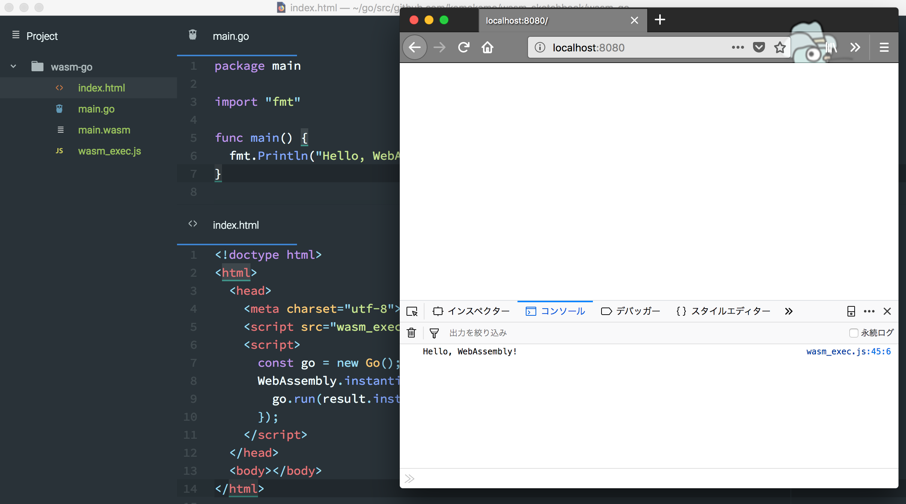

# Hello Wasm!

## How to build and serve

Write it with a command using fish shell.

```sh
env GOOS=js GOARCH=wasm go build -o main.wasm
```

```sh
cp (go env GOROOT)/misc/wasm/wasm_exec.js .
```

```sh
go get -u github.com/shurcooL/goexec
goexec 'http.ListenAndServe(":8080", http.FileServer(http.Dir(".")))'
```

Wow! The following screen will be displayed!


